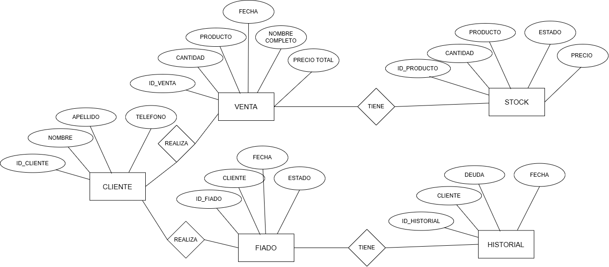

# Sistema de Venta Curichazo
Sistema web para la gestión de ventas y productos fiados . Desarrollado como proyecto final del curso de Java Web en SENATI.

## Descripcion del negocio
Nombre: Proyecto Curichazo  
Giro: Comercio minorista de curichis naturales tropicales con sistema de ventas al contado y fiados informales. 
Tamaño: Pequeña empresa, operacion individual  
Contexto: Negocio muy comun en el Peru donde una persona vende curichis o marcianos para este calor tropical en nuestra bella selva.  
Justificacion: Se necesita un sistema digital para reemplazar el cuaderno manual de la dueña en cual debemos evitar errores y tener un control claro de cada venta  y fiados.

## Identificar el problema y solución
Problema: La dueña lleva el registro de ventas y fiados en un cuaderno , lo que genera errores, perdida de informacion, dificultad para saber cuanto debe cada cliente.  
Solucion tecnologica: Desarrollar un sistema web con Java Spring Boot y MySQL que permita registrar clientes,ventas y fiados, mostrando en todo momento el estado de cada venta y el historial de pagos.

 
## Requerimientos Funcionales
| Codigo | Descripcion |
|---|---|
| RF01 | El sistema debe permitir registrar un nuevo cliente con nombre, apellido, telefono y direccion |
| RF02 | El sistema debe permitir registrar una nueva venta indicando el monto total, fiado, fecha de inicio |
| RF03 | El sistema debe permitir registrar el cobro de las ventas de los curichis fiados y al contado |
| RF04 | El sistema debe mostrar el listado de todos los clientes con su estado de deuda |
| RF05 | El sistema debe mostrar el historial de cobros realizados por venta al contado y fiado |
 
## Requerimientos No Funcionales
 
| Codigo | Tipo | Descripcion |
|---|---|---|
| RNF01 | Rendimiento | El sistema debe cargar cada pantalla en menos de 3 segundos |
| RNF02 | Usabilidad | La interfaz debe ser intuitiva y facil de usar sin necesidad de capacitacion previa |
| RNF03 | Seguridad | Solo usuarios autorizados podran acceder al sistema mediante usuario y contraseña |
## Stack completo
1. Trello             = Gestión del proyecto (Kanban)
2. Draw.io            = Diagrama ER + Diagrama de Clases
3. Figma              = Wireframe + Diseño UI/UX
4. MySQL Workbench    = Diseñar y administrar BD
5. IntelliJ           = Frontend (HTML,CSS,JS) + Backend (Spring Boot)
6. XAMPP              = Servidor Tomcat para correr la app

## Tecnologias utilizadas
- Java 17
- Spring Boot 3
- MySQL 8
- HTML5, CSS3, JavaScript
- IntelliJ IDEA
- XAMPP (Tomcat)
- MySQL Workbench
- Figma (diseño UI/UX)
- Draw.io (diagramas)

## Base de datos
 
El sistema cuenta con 4 tablas principales:
 
| Tabla | Descripcion |
|---|---|
| DUEÑA | Personas encargadas de gestionar y cobrar los fiadoss |
| CLIENTE | Personas que solicitan el producto |
| REGISTRO | Registramos cada venta  |
| COBRO | Registro del  pago  realizado |

  
### Diagrama Entidad-Relacion (DER)

 
### Modelo Relacional (MR)

### DIAGRAMA DE FIGMA
<iframe style="border: 1px solid rgba(0, 0, 0, 0.1);" width="800" height="450" src="https://embed.figma.com/design/BXoCcKRR9FjiXnO5TxFhuK/Proyecto-Senati?node-id=1-7&embed-host=share" allowfullscreen></iframe>

 <iframe width="560" height="315" src="https://www.youtube.com/embed/fxKnmW0QxHQ" frameborder="0" allow="accelerometer; autoplay; clipboard-write; encrypted-media; gyroscope; picture-in-picture" allowfullscreen></iframe>
