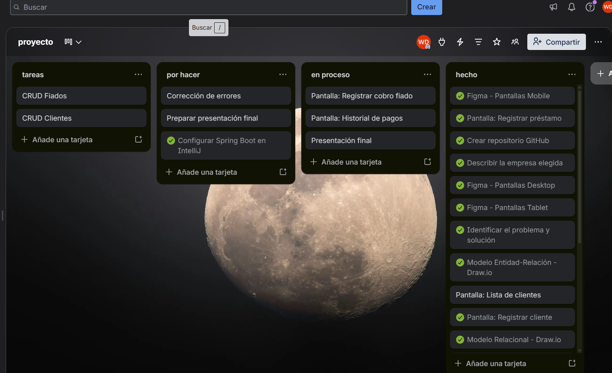
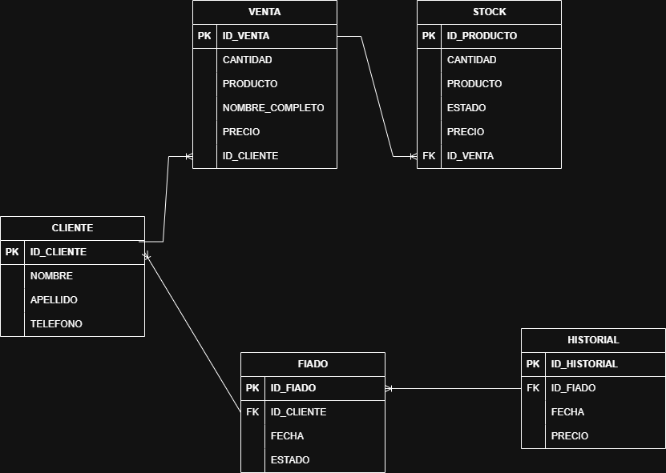

## TRELLO


---

# Sistema de Gestión de Ventas - Curichazo
Sistema web para la gestión de ventas, stock, clientes y fiados de una empresa de venta de curichis (helados artesanales). Desarrollado como proyecto final del curso de Java Web en SENATI.

## Descripción del negocio
Nombre: Curichazo <br>
Giro: Venta de curichis (helados artesanales) <br>
Tamaño: Pequeña empresa, operación familiar <br>
Contexto: Negocio muy común en Pucallpa donde se venden curichis en la calle o en un puesto fijo. La vendedora entrega curichis a clientes de confianza sin cobrar al instante (fiados), lo que genera confusión entre lo cobrado y lo fiado. <br>
Justificación: Se necesita un sistema digital para reemplazar el cuaderno manual de la vendedora, evitar errores, y tener un control claro de cada venta, el stock disponible y los fiados pendientes de cobro.

## Identificar el problema y solución
Problema: La vendedora lleva el registro de ventas y fiados en un cuaderno o de memoria, lo que genera errores, mezcla de pagos al contado con deudas, pérdida de información y dificultad para saber cuánto debe cada cliente. <br>
Solución tecnológica: Desarrollar un sistema web con Java Spring Boot y MySQL que permita registrar clientes, ventas, stock y fiados, mostrando en todo momento el estado de cada deuda y el historial de pagos realizados.

---

## Requerimientos Funcionales

| Código | Descripción |
|---|---|
| RF01 | El sistema debe permitir registrar un nuevo cliente con nombre, apellido y teléfono |
| RF02 | El sistema debe permitir registrar una venta indicando comprador, producto, cantidad y fecha |
| RF03 | El sistema debe permitir registrar un fiado asociando un cliente con una deuda pendiente |
| RF04 | El sistema debe permitir marcar un fiado como pagado, moviéndolo al historial automáticamente |
| RF05 | El sistema debe mostrar el listado de todos los productos en stock con su estado |
| RF06 | El sistema debe mostrar el historial de pagos de fiados realizados |

## Requerimientos No Funcionales

| Código | Tipo | Descripción |
|---|---|---|
| RNF01 | Rendimiento | El sistema debe cargar cada pantalla en menos de 3 segundos |
| RNF02 | Usabilidad | La interfaz debe ser intuitiva y fácil de usar sin necesidad de capacitación previa |
| RNF03 | Seguridad | Solo usuarios autorizados podrán acceder al sistema mediante correo y contraseña |
| RNF04 | Responsividad | El sistema debe funcionar correctamente en dispositivos móviles y desktop |

---

## Stack completo
1. Trello          = Gestión del proyecto (Kanban)
2. Draw.io         = Diagrama ER + Diagrama de Clases
3. Figma           = Wireframe + Diseño UI/UX
4. MySQL Workbench = Diseñar y administrar BD
5. IntelliJ IDEA   = Backend (Spring Boot)
6. VS Code         = Frontend (HTML, CSS, JS)

## Tecnologías utilizadas
- Java 25
- Spring Boot 3.5.13
- MySQL 8
- HTML5, CSS3, JavaScript
- Bootstrap 5.3.3
- Font Awesome 6.5.0
- IntelliJ IDEA
- MySQL Workbench
- Figma (diseño UI/UX)
- Draw.io (diagramas)

---

## Estructura del proyecto

```
curichazo/
├── frontend/               → HTML, CSS, JS
│   ├── css/
│   │   └── style.css
│   ├── js/
│   │   ├── main.js
│   │   └── sidebar.js
│   └── index.html
└── backend/                → Spring Boot (Java)
    ├── pom.xml
    ├── curichazo_db.sql
    └── src/main/java/com/senati/gotagota/
        ├── GotagotaApplication.java
        ├── CorsConfig.java
        ├── model/
        ├── repository/
        └── controller/
```

---

### DIAGRAMA DE FIGMA UI/UX


---

## Base de datos

El sistema cuenta con 5 tablas principales:

| Tabla | Descripción |
|---|---|
| clientes | Personas que compran los curichis |
| stock | Productos disponibles para la venta |
| ventas | Registro de cada venta realizada |
| fiados | Registro de deudas pendientes de cobro |
| historial_fiados | Registro de fiados que ya fueron pagados |

### Diagrama Entidad-Relación (DER)


### Modelo Relacional (MR)


### Cardinalidades
CLIENTE — VENTA (1:N) <br>
Un cliente puede tener muchas ventas, pero una venta pertenece a un solo cliente. <br>
CLIENTE — FIADO (1:N) <br>
Un cliente puede tener muchos fiados, pero un fiado pertenece a un solo cliente. <br>
FIADO — HISTORIAL_FIADO (1:1) <br>
Cuando un fiado se marca como pagado, se mueve al historial con fecha de pago registrada.

| Entidad A | Relación | Entidad B | Cardinalidad |
|---|---|---|---|
| CLIENTE | realiza | VENTA | 1:N |
| CLIENTE | genera | FIADO | 1:N |
| FIADO | se convierte en | HISTORIAL_FIADO | 1:1 |

---

### Base de datos

```sql
-- base de datos para el sistema de curichis
create database  curichazo_db;

use curichazo_db;

-- tabla de clientes
create table cliente (
    id_cliente int auto_increment primary key,
    nombre varchar(100) not null,
    apellido varchar(100) not null,
    telefono varchar(15)
);

-- tabla de ventas
create table venta (
    id_venta int auto_increment primary key,
    cantidad int not null,
    producto varchar(100) not null,
    nombre_completo varchar(200) not null,
    precio decimal(10,2) not null,
    id_cliente int not null,
    foreign key (id_cliente) references cliente(id_cliente)
);

-- stock de productos
create table stock (
    id_producto int auto_increment primary key,
    cantidad int not null,
    producto varchar(100) not null,
    estado enum('Disponible', 'Bajo stock', 'Agotado') default 'Disponible',
    precio decimal(10,2) not null,
    id_venta int,
    foreign key (id_venta) references venta(id_venta)
);

-- fiados pendientes
create table fiado (
    id_fiado int auto_increment primary key,
    id_cliente int not null,
    fecha date not null,
    estado enum('Pendiente', 'Pagado') default 'Pendiente',
    foreign key (id_cliente) references cliente(id_cliente)
);

-- historial de fiados pagados
create table historial (
    id_historial int auto_increment primary key,
    id_fiado int not null,
    fecha date not null,
    precio decimal(10,2) not null,
    foreign key (id_fiado) references fiado(id_fiado)
);

-- datos de prueba
insert into cliente (nombre, apellido, telefono) values
('Ana', 'Torres', '987654321'),
('Carlos', 'Quispe', '912345678'),
('Lucía', 'Mamani', '923456789'),
('Pedro', 'Huanca', '934567890'),
('Rosa', 'Flores', '945678901'),
('Miguel', 'Soto', '956789012');

insert into venta (cantidad, producto, nombre_completo, precio, id_cliente) values
(20, 'Mango', 'Ana Torres', 10.00, 1),
(15, 'Fresa', 'Carlos Quispe', 7.50, 2),
(18, 'Coco con leche', 'Lucía Mamani', 10.80, 3),
(12, 'Aguaje', 'Pedro Huanca', 9.60, 4),
(8, 'Gelatina', 'Rosa Flores', 3.20, 5);

insert into stock (cantidad, producto, estado, precio, id_venta) values
(80, 'Mango', 'Disponible', 0.50, 1),
(60, 'Coco con leche', 'Disponible', 0.60, 3),
(45, 'Fresa', 'Disponible', 0.50, 2),
(30, 'Aguaje', 'Disponible', 0.80, 4),
(10, 'Gelatina', 'Bajo stock', 0.40, 5);

insert into fiado (id_cliente, fecha, estado) values
(1, '2026-04-10', 'Pendiente'),
(2, '2026-04-09', 'Pendiente'),
(3, '2026-04-08', 'Pendiente'),
(4, '2026-04-07', 'Pendiente'),
(5, '2026-04-07', 'Pendiente'),
(6, '2026-04-06', 'Pendiente');

insert into historial (id_fiado, fecha, precio) values
(1, '2026-04-12', 5.00),
(2, '2026-04-11', 3.50);
```

---

## Cómo correr el proyecto

### Requisitos previos
- Tener instalado IntelliJ IDEA
- Tener instalado MySQL + MySQL Workbench
- Tener instalado JDK 25 o superior pero recomendable usar una version anterior para evitar errores
- Tener instalado VS Code (para el frontend)

### Backend
1. Abrir la carpeta `backend/` en IntelliJ IDEA
2. Configurar `application.properties` con los datos de MySQL
3. Iniciar MySQL desde MySQL Workbench
4. Ejecutar `GotagotaApplication.java`
5. El backend corre en: `http://localhost:8080`

### Frontend
1. Abrir la carpeta `frontend/` en VS Code
2. Abrir `index.html` con Live Server
3. El frontend se comunica con el backend via `fetch()`

> El frontend y el backend corren por separado.
> El backend debe estar iniciado antes de abrir el frontend.

### Configuración de base de datos

```properties
spring.application.name=gotagota

# CONEXION A MYSQL
spring.datasource.url=jdbc:mysql://localhost:3306/curichazo_db?useSSL=false&serverTimezone=America/Lima&allowPublicKeyRetrieval=true
spring.datasource.username=root
spring.datasource.password=
spring.datasource.driver-class-name=com.mysql.cj.jdbc.Driver

# JPA / HIBERNATE
spring.jpa.hibernate.ddl-auto=update
spring.jpa.show-sql=true
spring.jpa.properties.hibernate.dialect=org.hibernate.dialect.MySQLDialect

# Puerto del servidor
server.port=8080
```

---

## Endpoints de la API

Base URL: `http://localhost:8080/api`

| Método | Endpoint | Descripción |
|---|---|---|
| GET | `/clientes` | Listar clientes |
| POST | `/clientes` | Crear cliente |
| PUT | `/clientes/{id}` | Editar cliente |
| DELETE | `/clientes/{id}` | Eliminar cliente |
| GET | `/stock` | Listar stock |
| POST | `/stock` | Crear producto |
| PUT | `/stock/{id}` | Editar producto |
| DELETE | `/stock/{id}` | Eliminar producto |
| GET | `/ventas` | Listar ventas |
| POST | `/ventas` | Registrar venta |
| PUT | `/ventas/{id}` | Editar venta |
| DELETE | `/ventas/{id}` | Eliminar venta |
| GET | `/fiados` | Listar fiados pendientes |
| POST | `/fiados` | Registrar fiado |
| PATCH | `/fiados/{id}/pagar` | Marcar pagado → pasa al historial |
| GET | `/historial-fiados` | Ver historial de pagos |

---

## Autor

Desarrollado como proyecto escolar en **SENATI**.

- 📚 Curso: Java Web
- 🏫 Instituto: SENATI — Pucallpa
- 👤 GitHub: [Takuya123456](https://github.com/Takuya123456)
- 📅 Año: 2026

